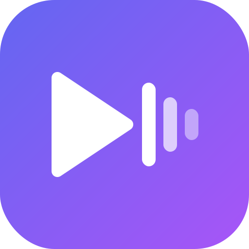
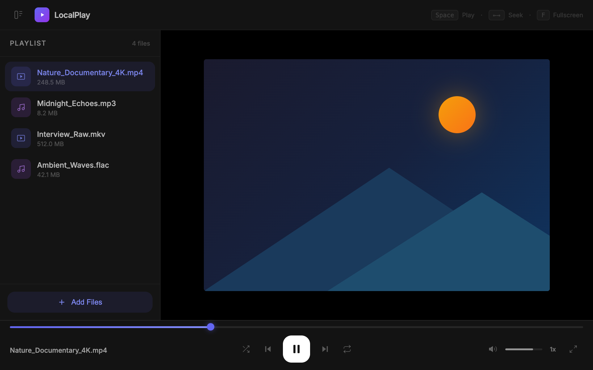
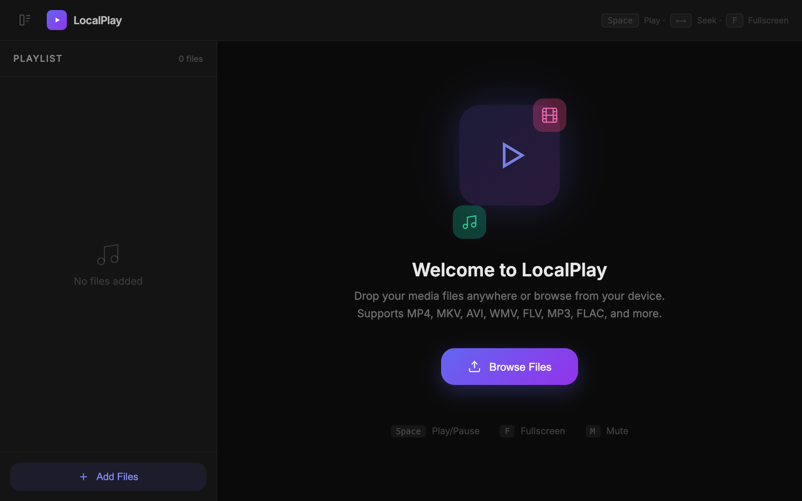
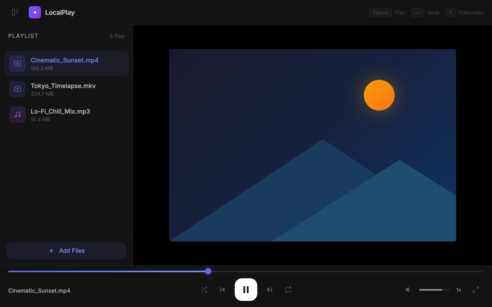
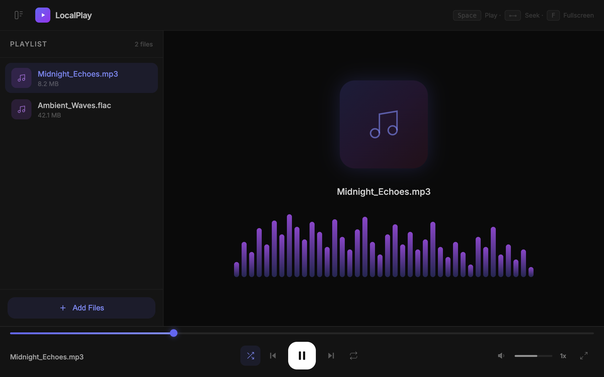
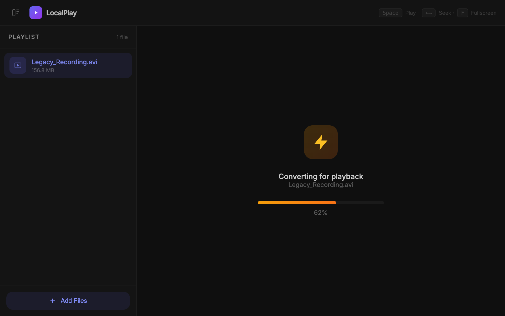
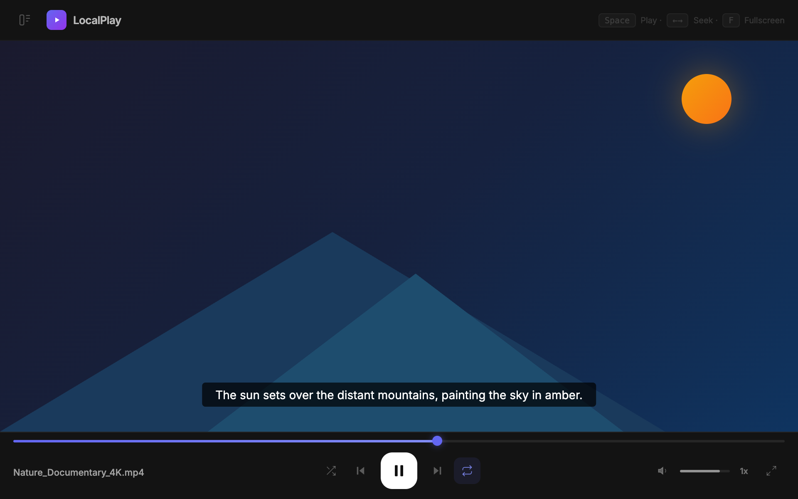
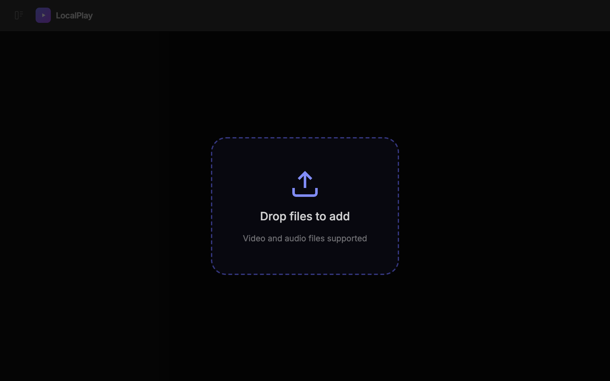

<div align="center">



# LocalPlay

### A privacy-first, browser-native media player.

**Play any video or audio file directly in your browser — no uploads, no servers, no tracking.**

[](https://react.dev/)
[](https://vitejs.dev/)
[](https://tailwindcss.com/)
[](#-license)
[](#-contributing)

<br />



<br />

[Features](#-features) · [Screenshots](#-screenshots) · [Getting Started](#-getting-started) · [Keyboard Shortcuts](#-keyboard-shortcuts) · [Architecture](#-architecture) · [Contributing](#-contributing) · [License](#-license)

</div>

---

## Why LocalPlay?

Most media players either require installation, or upload your files to remote servers. **LocalPlay** runs entirely in the browser — your files never leave your device. It leverages modern Web APIs and WebAssembly-powered FFmpeg to handle virtually any format, including legacy codecs that browsers don't natively support.

---

## ✨ Features

<table>
<tr>
<td width="50%">

### Core Playback
- **Video & Audio support** — MP4, MKV, WebM, OGG, MOV, AVI, WMV, FLV, MP3, FLAC, WAV, AAC, M4A, Opus, and more
- **In-browser transcoding** — Unsupported formats (AVI, WMV, FLV, WMA, etc.) are automatically converted via FFmpeg WASM
- **Subtitle support** — Load external SRT, VTT, ASS/SSA subtitle files with automatic format conversion
- **Playback speed** — Granular control from 0.25x to 3x

</td>
<td width="50%">

### Experience
- **Audio visualizer** — Real-time frequency spectrum visualization powered by Web Audio API
- **Picture-in-Picture** — Pop out video into a floating window
- **Fullscreen mode** — Immersive viewing with double-click or keyboard toggle
- **Glassmorphism UI** — Dark, modern interface with blur effects and smooth Framer Motion animations

</td>
</tr>
<tr>
<td>

### Playlist Management
- **Drag & drop** — Drop files anywhere on the window to add them
- **Sidebar playlist** — Collapsible sidebar with track listing, file sizes, and quick controls
- **Shuffle & Repeat** — Repeat off / one / all, and shuffle modes
- **Add / Remove / Clear** — Full playlist CRUD

</td>
<td>

### Privacy & Performance
- **100% client-side** — Zero network requests for media processing
- **No accounts, no telemetry** — Your data stays on your machine
- **Lazy FFmpeg loading** — WASM core is loaded on-demand only when transcoding is needed
- **Lightweight** — Minimal dependency footprint

</td>
</tr>
</table>

---

## 📸 Screenshots

> **Note:** Replace the placeholder paths below with your own screenshots by adding images to `docs/screenshots/`.

<div align="center">

| Empty State | Video Playback |
|:-:|:-:|
|  |  |

| Audio Visualizer | Transcoding |
|:-:|:-:|
|  |  |

| Subtitle Support | Drag & Drop |
|:-:|:-:|
|  |  |

</div>

---

## 🚀 Getting Started

### Prerequisites

- **Node.js** ≥ 18
- **npm** ≥ 9 (or **yarn** / **pnpm**)

### Installation

```bash
# Clone the repository
git clone https://github.com/your-username/localplay.git
cd localplay

# Install dependencies
npm install

# Start the development server
npm run dev
```

The app will be available at **`http://localhost:5173`**.

### Build for Production

```bash
npm run build
npm run preview   # Preview the production build
```

> **Note:** The Vite config includes `Cross-Origin-Opener-Policy` and `Cross-Origin-Embedder-Policy` headers required for FFmpeg WASM (SharedArrayBuffer). Ensure your production server sets these headers as well.

---

## ⌨️ Keyboard Shortcuts

| Key | Action |
|:---|:---|
| <kbd>Space</kbd> | Play / Pause |
| <kbd>←</kbd> | Seek backward 5s |
| <kbd>→</kbd> | Seek forward 5s |
| <kbd>↑</kbd> | Volume up |
| <kbd>↓</kbd> | Volume down |
| <kbd>M</kbd> | Toggle mute |
| <kbd>F</kbd> | Toggle fullscreen |
| <kbd>P</kbd> | Toggle Picture-in-Picture |
| <kbd>N</kbd> | Next track |
| <kbd>B</kbd> | Previous track |
| <kbd>[</kbd> | Decrease playback speed (−0.25x) |
| <kbd>]</kbd> | Increase playback speed (+0.25x) |

---

## 📂 Supported Formats

<details>
<summary><strong>Video</strong></summary>

| Format | Extension | Native | Transcoded |
|:---|:---|:---:|:---:|
| MP4 | `.mp4` | ✅ | — |
| WebM | `.webm` | ✅ | — |
| MKV | `.mkv` | ✅ | — |
| MOV | `.mov` | ✅ | — |
| OGG | `.ogg`, `.ogv` | ✅ | — |
| M4V | `.m4v` | ✅ | — |
| AVI | `.avi` | — | ✅ |
| WMV | `.wmv` | — | ✅ |
| FLV | `.flv` | — | ✅ |
| 3GP | `.3gp` | — | ✅ |
| RMVB/RM | `.rmvb`, `.rm` | — | ✅ |
| ASF | `.asf` | — | ✅ |

</details>

<details>
<summary><strong>Audio</strong></summary>

| Format | Extension | Native | Transcoded |
|:---|:---|:---:|:---:|
| MP3 | `.mp3` | ✅ | — |
| WAV | `.wav` | ✅ | — |
| FLAC | `.flac` | ✅ | — |
| AAC | `.aac` | ✅ | — |
| M4A | `.m4a` | ✅ | — |
| Opus | `.opus` | ✅ | — |
| OGG | `.ogg`, `.oga` | ✅ | — |
| WMA | `.wma` | — | ✅ |
| AMR | `.amr` | — | ✅ |

</details>

<details>
<summary><strong>Subtitles</strong></summary>

| Format | Extension |
|:---|:---|
| SubRip | `.srt` |
| WebVTT | `.vtt` |
| Advanced SSA | `.ass` |
| SubStation Alpha | `.ssa` |

All subtitle formats are parsed and converted to WebVTT on the fly for native `<track>` element rendering.

</details>

---

## 🏗 Architecture

```
src/
├── components/
│   ├── AudioPlayer.jsx       # Audio playback + real-time frequency visualizer (Canvas + Web Audio API)
│   ├── VideoPlayer.jsx       # Video element with subtitle track support
│   ├── Controls.jsx          # Transport bar: play, seek, shuffle, repeat, speed, PiP, fullscreen
│   ├── SeekBar.jsx           # Interactive progress / seek bar
│   ├── VolumeControl.jsx     # Volume slider with mute toggle
│   ├── Sidebar.jsx           # Collapsible playlist panel
│   ├── PlaylistItem.jsx      # Individual track row in the sidebar
│   ├── PlayerArea.jsx        # Main content area (routes to Video/Audio player or Empty state)
│   ├── EmptyState.jsx        # Welcome screen with animated drop prompt
│   ├── DropZone.jsx          # Global drag-and-drop overlay
│   ├── Layout.jsx            # App shell — top bar, sidebar, player, controls
│   ├── SubtitleLoader.jsx    # Subtitle file picker button
│   └── TranscodeOverlay.jsx  # Transcoding progress modal
│
├── context/
│   └── PlayerContext.jsx      # Global state via useReducer — playlist, playback, UI state
│
├── hooks/
│   ├── useKeyboardShortcuts.js  # Global keyboard event handler
│   ├── useMediaFile.js          # File type resolution helper
│   ├── useSubtitles.js          # Subtitle loading and lifecycle
│   └── useTranscode.js          # FFmpeg WASM transcoding pipeline
│
├── utils/
│   ├── formats.js             # Format detection, extension maps, native support checks
│   ├── subtitleParser.js      # SRT / ASS / SSA / VTT parser and VTT converter
│   └── time.js                # Time formatting utilities
│
├── App.jsx                    # Root component — wraps Layout in PlayerProvider
├── main.jsx                   # Entry point
└── index.css                  # Global styles, glassmorphism classes, scrollbar, range inputs
```

### Key Design Decisions

- **`useReducer` over external state libraries** — Keeps the bundle small and avoids unnecessary dependencies for a single-page player app.
- **FFmpeg WASM loaded lazily** — The ~30 MB core is fetched from a CDN only when a non-native format is detected, keeping initial load times fast.
- **Subtitle format normalization** — All subtitle formats are parsed client-side and converted to WebVTT blobs, allowing use of the browser's native `<track>` element.
- **Framer Motion for animations** — Provides fluid micro-interactions (hover, tap, layout transitions) without manual CSS keyframe management.

---

## 🛠 Tech Stack

| Layer | Technology |
|:---|:---|
| **Framework** | [React 18](https://react.dev/) |
| **Build Tool** | [Vite 5](https://vitejs.dev/) |
| **Styling** | [Tailwind CSS 3.4](https://tailwindcss.com/) |
| **Animations** | [Framer Motion](https://www.framer.com/motion/) |
| **Icons** | [Lucide React](https://lucide.dev/) |
| **Transcoding** | [FFmpeg WASM](https://ffmpegwasm.netlify.app/) |
| **Linting** | [ESLint 9](https://eslint.org/) |

---

## 🤝 Contributing

Contributions are welcome! Whether it's a bug fix, feature, or documentation improvement — every PR is appreciated.

1. **Fork** the repository
2. **Create** your feature branch: `git checkout -b feature/amazing-feature`
3. **Commit** your changes: `git commit -m 'feat: add amazing feature'`
4. **Push** to the branch: `git push origin feature/amazing-feature`
5. **Open** a Pull Request

Please make sure to:
- Follow the existing code style
- Test your changes locally
- Keep PRs focused and atomic

---

## 📄 License

This project is licensed under the **MIT License** — see the [LICENSE](LICENSE) file for details.

---

<div align="center">

**Built with 💜 and modern web technologies.**

<sub>If you found this useful, consider giving it a ⭐</sub>

</div>

